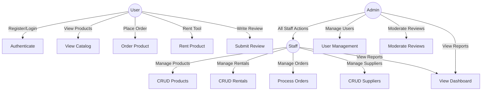
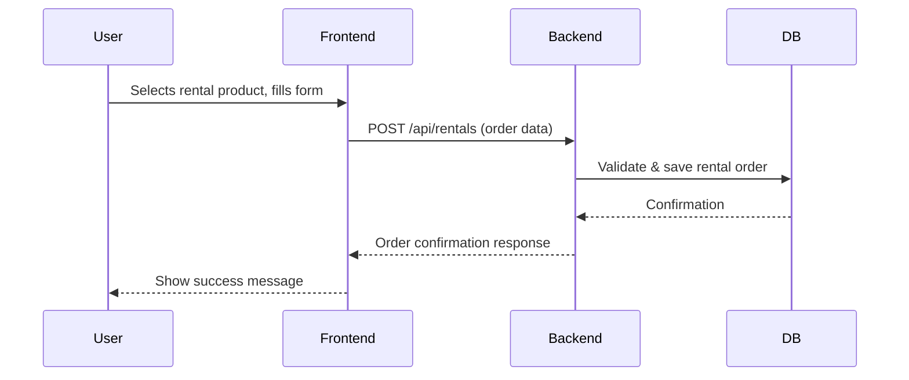
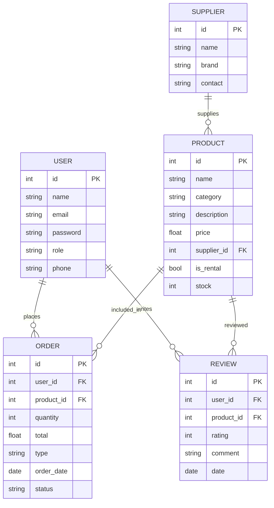

# Thangam-Server — Backend Documentation

## Overview

**Thangam-Server** is the backend REST API for Thangam, a platform for renting and selling gardening tools and fertilizers. It powers the Thangam-Client frontend and handles all business logic, authentication, authorization, data persistence, and communication with the database.

---

## Features

- **User Management**: Authentication (JWT), registration, roles (admin, staff, user)
- **Product Management**: CRUD for products (tools and fertilizers), categories, inventory
- **Rental Management**: Rental products, rental orders, availability tracking
- **Order Management**: Handle purchase and rental orders, status updates, payment integration (if any)
- **Supplier Management**: Manage supplier data and relations to products
- **Review System**: Users can leave reviews on products, admins moderate
- **Dashboard & Reporting**: Sales, rentals, user and inventory statistics (for admin/staff)
- **Role-Based Access Control**: Secure endpoints for different user roles

---

## Use Case Diagram



---

## Sequence Diagram: Placing a Rental Order



---

## ER Diagram



---

## API Structure Example

- `/api/auth` — Authentication routes (login, register)
- `/api/users` — User management (CRUD, profile, roles)
- `/api/products` — Product CRUD
- `/api/rentals` — Rental product and order management
- `/api/orders` — Purchase order management
- `/api/suppliers` — Supplier CRUD
- `/api/reviews` — Product reviews
- `/api/dashboard` — Admin/staff reporting

---

## Technologies Used

- Node.js, Express.js
- Database: (e.g., MongoDB, MySQL, PostgreSQL — specify your DB)
- JWT for authentication
- RESTful API design
- Middleware for validation and security

---

## Setup & Deployment

1. Clone the repository:
   ```bash
   git clone https://github.com/Mathura-skr/Thangam-Server.git
   cd Thangam-Server
   ```
2. Install dependencies:
   ```bash
   npm install
   ```
3. Configure environment variables (`.env` file):
   - Database URI
   - JWT secret
   - Other configs as required

4. Start the server:
   ```bash
   npm start
   ```

---
